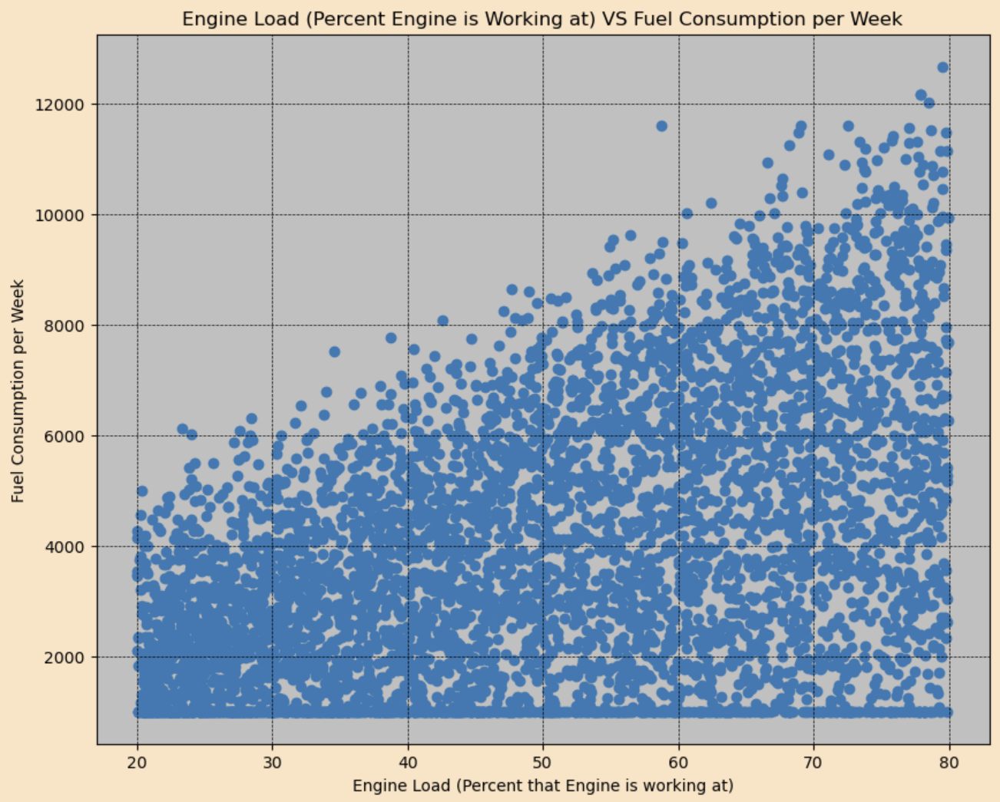
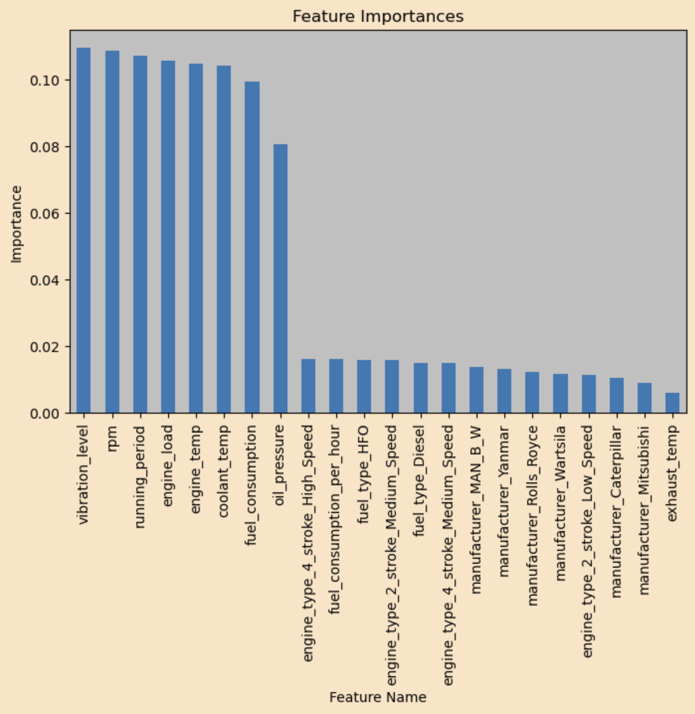
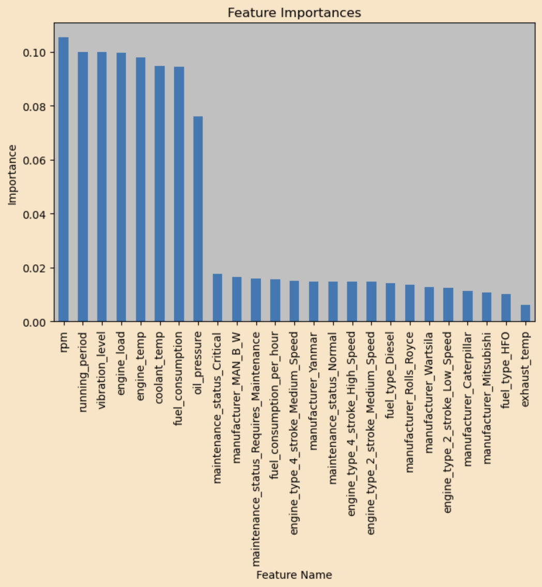

# Preventative Maintenance for Marine Engines: Predicting Engine Failure

Engine failures can be expensive and can result in downtime. The goal of this project was to build a prediction model based on a dataset to allow user input to see if a engine would fail. These predictions provide insights into what can cause an engine to fail and can be used to monitor engine health.

# Table of Contents

- Dataset
- Questions?
- Data Analysis Graphs
- Predicting Engine Maintenance Status
- Predicting Engine Failure
- Feature Importance
- Future Study
- Credits

# Dataset

- 5200 Rows, 17 Columns

- timestamp: The date of the information in that row
- engine_id: Engine Identifier
- engine_temp: The temperature of the Engine in Celsius
- oil_pressure: Oil pressure in bars. 1 bar is 14.5 psi
- fuel_consumption: Liters per Hour
- vibration_level: Millimeters per Second
- Engine Revolutions per Minute (rev/min)
- engine_load: Percent the Engine is working at (%)
- coolant_temp: Temperature of Engine Coolant in Celsius
- exhaust_temp: Temperature of the Exhaust in Celsius
- running_period: Hours per Week Engine has been running (0 - 168)
- maintenance_status: Warning that Engine needs Maintenance
- failure_mode: If the Engine has Failed, informs of type of Failure
- engine_type: The type of Engine
- fuel_type: The type of Fuel that the Engine uses
- manufacturer: The Manufacturer that produced the Engine

# Questions?

The following are some questions I had prior to starting my initial data analysis:

- What are the most important factors that determine engine failure?
- Do any columns have less of an impact on engine failures?
- Do engines from any manufacturer have a higher chance to fail?

# Data Analysis Graphs

# Predicting Engine Maintenance Status

On this page is the Maintenance Status Prediction Model. Here you can move the sliders and change the options in the select boxes and at the bottom of the page you will get a prediction of what kind of maintenance status you can expect to see with a engine that has all of those settings. The Prediction Model used is a Random Forest Model.

# Predicting Engine Failure

On this page is the Failure Prediction Model. Here you can move the sliders and change the options in the select boxes and at the bottom of the page you will get a prediction of the failure you can expect to see with a engine that has all of those settings. The Prediction Model used is a Random Forest Model.

# Feature Importance

- The numbers under Importance all add up to 1. The greater the number the more importance that feature is considered to be.

# Future Study

- Other types of engines besides marine engines
- Engine datasets with more data included
- Look at manufacturers not included in this dataset
- Focus on a single manufacturer and its engines
- Try to compare costs of engines

# Credits

- Image on Home is from here: https://engine-genset.mhi.com/marine-engines
- My dataset was found on Kaggle.com from user Fijabi J. Adekunle: https://www.kaggle.com/datasets/jeleeladekunlefijabi/preventive-maintenance-for-marine-engines
- Referenced for unit of measurements of columns in dataset: https://www.kaggle.com/code/jeleeladekunlefijabi/predictive-maintenance-for-marine-engines-notebook
- Lastly Chad for all of his help.
- Contact Info: tate.cottom@spaceforce.mil